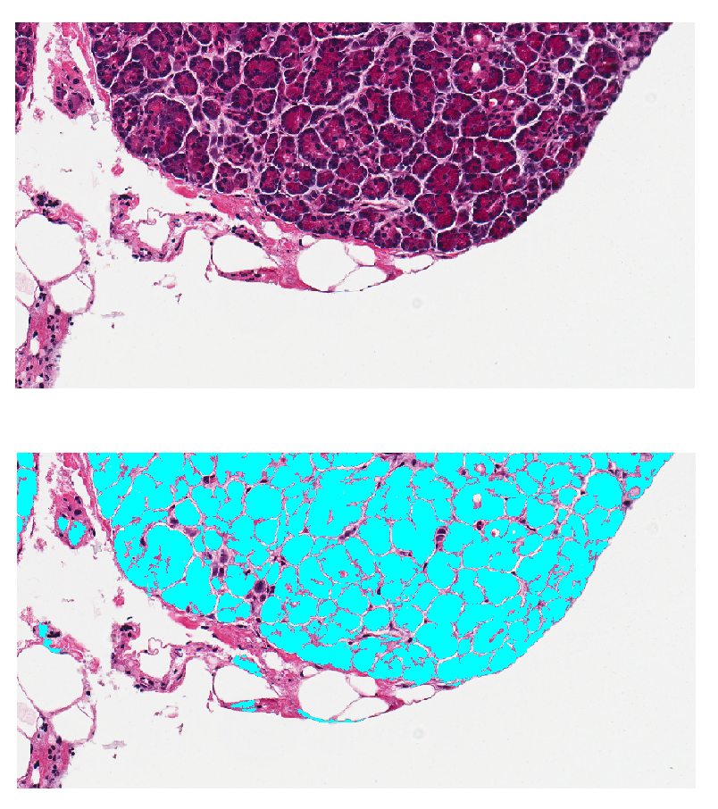

# Acinar-detection-histology
A rule based model to detect acinar cells in histology images. 

The current version of this model is not optimized for processing large segments (those consisting of many pixels). Therefore, if images with such segments are tested, the model may require several minutes to a few hours to complete the execution. E.g. **image3.tif** in `Sample outputs` directory. 
