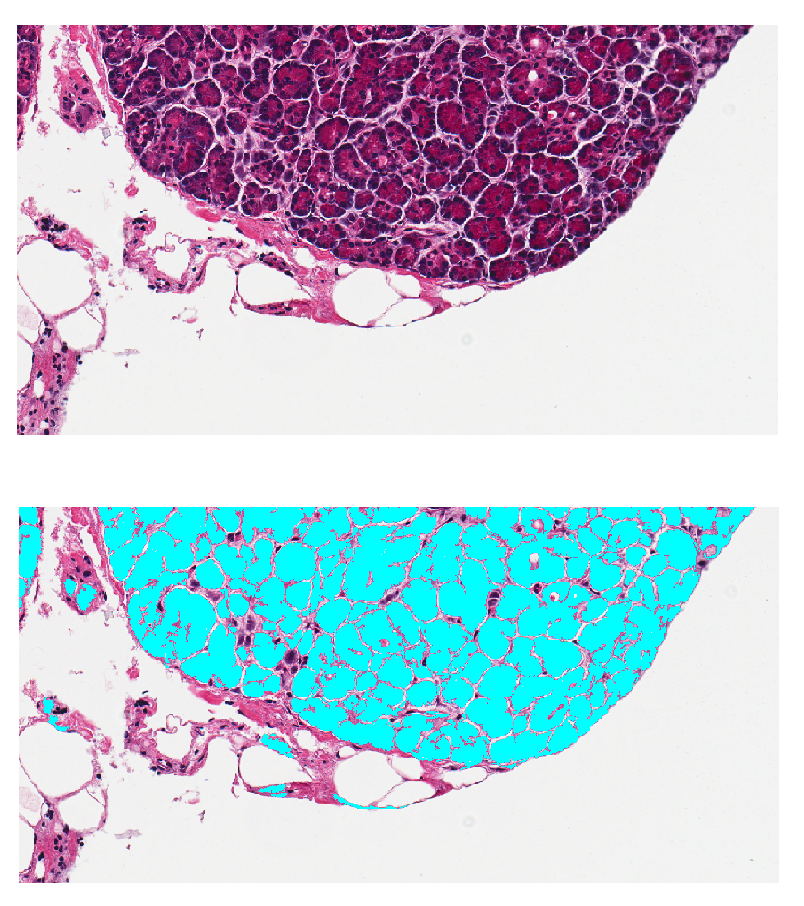

# Acinar-detection-histology
A rule based model to detect acinar cells in histology images. 

The current model is not optimized for handling large acinar segments with high pixel counts. Consequently, processing such images may take from several minutes to several hours. E.g. **image3.tif** in `Sample outputs` directory. 
